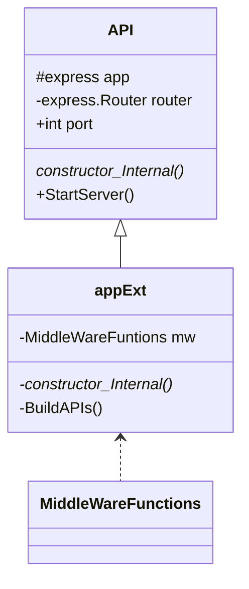

## Simple Node Rest Service Template 

### purpose 
* AWS 나 다른 AI 서비스를 위한 중계 Rest API 서버의 탬플릿..
### 구조


* MiddleWareFunctions 에서 필요한 로직을 구현한다. 
* appExt 의 BuildAPIs() 함수 내에서 RESP API VERB 규칙에 맞추어 추가한다. 
* Example
```
    this.app.get('/api', this.nlp.AskToServer); 
```

#### requirement
* Node - v14.19.0
* localhost:8486 포트

#### Setup


